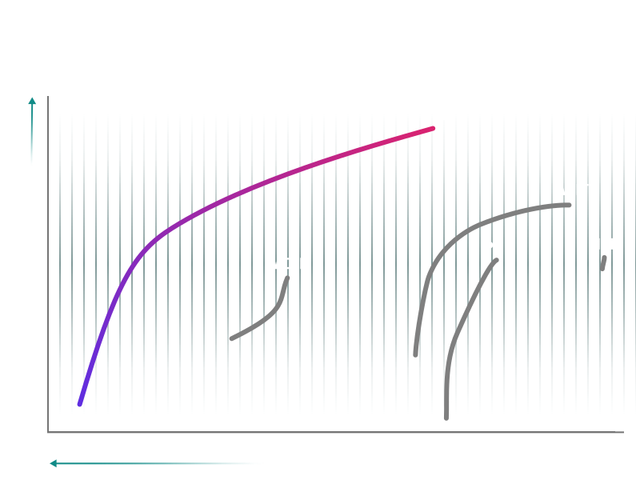
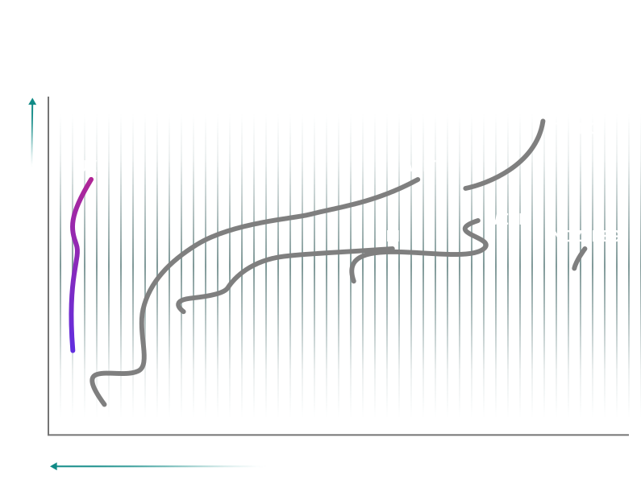

<!DOCTYPE html><!--  Last Published: Fri Sep 06 2024 21:58:03 GMT+0000 (Coordinated Universal Time)  -->
<html data-wf-page="6650be52b1fb581f8c10331b" data-wf-site="6650be52b1fb581f8c103315">

<head>
  <meta charset="utf-8">
  <title>JPEG XL</title>
  <meta content="width=device-width, initial-scale=1" name="viewport">
  <link href="css/normalize.css" rel="stylesheet" type="text/css">
  <link href="css/webflow.css" rel="stylesheet" type="text/css">
  <link href="css/jpeg-xl-test.webflow.css" rel="stylesheet" type="text/css">
  <link href="https://fonts.googleapis.com" rel="preconnect">
  <link href="https://fonts.gstatic.com" rel="preconnect" crossorigin="anonymous">
  
  
  
  <link href="images/favicon.png" rel="shortcut icon" type="image/x-icon">
  <link href="images/webclip.png" rel="apple-touch-icon">
  
</head>

<body class="body">

  

    <section class="section-jpeg-xl-hero gradient-bottom">
      

      

        

          

            <h1 class="text-xxl-regular centered teal">JPEG XL</h1>
            

            <h1 class="display-xl-bold fill-gradient">Industry-leading image compression &amp; fidelity</h1>
            

          

          

            <h2 class="text-xxl-regular centered teal">Smaller Files, Higher Quality, Faster Downloads.</h2>
          

        

      

      

      

        

          

          

        

        

          
Unmatched in quality-per-byte, JPEG&nbsp;XL delivers best-of-breed image
            compression from web quality through lossless.

        

      

    </section>
    <section class="section-jpeg-comparison">
      

      

        

          

            <h2 class="display-l-bold">JPEG&nbsp;XL is…</h2>
            

            <h3 class="text-xxl-regular centered teal">Up to 55% Smaller Than JPEG</h3>
            

          

          

            

              

                <h3 class="label-menu-text">JPEG</h3>
              

              

            

            

              

                <h3 class="label-menu-text">JPEG XL</h3>
              

              

            

          

          

            

              

                

                  

                    

                      

                        
                        <picture id="JPEGCompare_JXLImage" class="image1-after slider-image">
                          <source type="image/jxl" srcset="">
                          
                        </picture>
                      

                      <input type="range" min="0" max="100" value="50" class="image-slider"
                        aria-label="Percentage of before photo shown">
                      

                      

                        <svg width="24px" height="24px" viewbox="0 0 24 24" stroke-width="1.5" fill="none"
                          xmlns="http://www.w3.org/2000/svg" color="#000000">
                          <path d="M8 7L3 12L8 17" stroke="#000000" stroke-width="1.5" stroke-linecap="round"
                            stroke-linejoin="round"></path>
                          <path d="M16 7L21 12L16 17" stroke="#000000" stroke-width="1.5" stroke-linecap="round"
                            stroke-linejoin="round"></path>
                        </svg>
                      

                    

                    

                      

                      

                        <svg class="info-icon" width="24px" height="24px" stroke-width="1.5" viewbox="0 0 24 24"
                          fill="none" xmlns="http://www.w3.org/2000/svg" color="#ffffff">
                          <path d="M12 11.5V16.5" stroke="#ffffff" stroke-width="1.5" stroke-linecap="round"
                            stroke-linejoin="round"></path>
                          <path d="M12 7.51L12.01 7.49889" stroke="#ffffff" stroke-width="1.5" stroke-linecap="round"
                            stroke-linejoin="round"></path>
                          <path
                            d="M12 22C17.5228 22 22 17.5228 22 12C22 6.47715 17.5228 2 12 2C6.47715 2 2 6.47715 2 12C2 17.5228 6.47715 22 12 22Z"
                            stroke="#ffffff" stroke-width="1.5" stroke-linecap="round" stroke-linejoin="round"></path>
                        </svg>
                        

                          

                          <h4 id="image_Title" class="heading-desktop-h6">Image Title</h4>
                          

                            

                              <h4 class="text-m-regular">JPEG Info:</h4>
                              
Quality: 82
                              

                              
Size: 2.0 KB
                              

                              
BPP: 2.0
                              

                              

                                

                                  
SSIMULACRA2 Score: 80.1

                                  

                                    

                                      <svg class="triangle-left" width="13" height="14" viewbox="0 0 13 14"
                                        fill="#ffffff" xmlns="http://www.w3.org/2000/svg">
                                        <path
                                          d="M11.9264 6.68432C12.1743 6.82177 12.1743 7.17824 11.9264 7.31568L1.75315 12.9542C1.5126 13.0876 1.21725 12.9136 1.21725 12.6386L1.21725 1.36144C1.21725 1.0864 1.5126 0.912433 1.75316 1.04576L11.9264 6.68432Z"
                                          fill="#808080" stroke="black" stroke-width="0" stroke-linecap="round"
                                          stroke-linejoin="round"></path>
                                      </svg>
                                      <input type="range" min="0" max="100" step="1" value="50" class="tooltip-slider"
                                        id="JPEGCompare_JPEGSSIM2" readonly="">
                                      <svg class="triangle-right" width="13" height="14" viewbox="0 0 13 14" fill="none"
                                        xmlns="http://www.w3.org/2000/svg">
                                        <path
                                          d="M1.18595 7.31568C0.938016 7.17823 0.938016 6.82176 1.18595 6.68432L11.3591 1.04578C11.5997 0.912421 11.8951 1.08638 11.8951 1.3614L11.895 12.6386C11.895 12.9136 11.5997 13.0876 11.3591 12.9542L1.18595 7.31568Z"
                                          fill="#808080" stroke="black" stroke-width="0" stroke-linecap="round"
                                          stroke-linejoin="round"></path>
                                      </svg>
                                    

                                    

                                      
0

                                      
10

                                      
20

                                      
30

                                      
40

                                      
50

                                      
60

                                      
70

                                      
80

                                      
90

                                      
100

                                    

                                  

                                

                              

                              

                                

                                  
Butteraugli Score: 1.5
                                  

                                  

                                    

                                      <svg class="triangle-left" width="13" height="14" viewbox="0 0 13 14"
                                        fill="#ffffff" xmlns="http://www.w3.org/2000/svg">
                                        <path
                                          d="M11.9264 6.68432C12.1743 6.82177 12.1743 7.17824 11.9264 7.31568L1.75315 12.9542C1.5126 13.0876 1.21725 12.9136 1.21725 12.6386L1.21725 1.36144C1.21725 1.0864 1.5126 0.912433 1.75316 1.04576L11.9264 6.68432Z"
                                          fill="#808080" stroke="black" stroke-width="0" stroke-linecap="round"
                                          stroke-linejoin="round"></path>
                                      </svg>
                                      <input type="range" min="0" max="3" step=".1" value="1"
                                        class="tooltip-slider-reverse" readonly="">
                                      <svg class="triangle-right" width="13" height="14" viewbox="0 0 13 14" fill="none"
                                        xmlns="http://www.w3.org/2000/svg">
                                        <path
                                          d="M1.18595 7.31568C0.938016 7.17823 0.938016 6.82176 1.18595 6.68432L11.3591 1.04578C11.5997 0.912421 11.8951 1.08638 11.8951 1.3614L11.895 12.6386C11.895 12.9136 11.5997 13.0876 11.3591 12.9542L1.18595 7.31568Z"
                                          fill="#808080" stroke="black" stroke-width="0" stroke-linecap="round"
                                          stroke-linejoin="round"></path>
                                      </svg>
                                    

                                    

                                      
3

                                      
2.5

                                      
2

                                      
1.5

                                      
1

                                      
0.5

                                      
0

                                    

                                  

                                

                              

                              

                                

                                  
DSSIM (×1000) Score: 2.1
                                  

                                  

                                    

                                      <svg class="triangle-left" width="13" height="14" viewbox="0 0 13 14"
                                        fill="#ffffff" xmlns="http://www.w3.org/2000/svg">
                                        <path
                                          d="M11.9264 6.68432C12.1743 6.82177 12.1743 7.17824 11.9264 7.31568L1.75315 12.9542C1.5126 13.0876 1.21725 12.9136 1.21725 12.6386L1.21725 1.36144C1.21725 1.0864 1.5126 0.912433 1.75316 1.04576L11.9264 6.68432Z"
                                          fill="#808080" stroke="black" stroke-width="0" stroke-linecap="round"
                                          stroke-linejoin="round"></path>
                                      </svg>
                                      <input type="range" min="0" max="16" step=".5" value="2"
                                        class="tooltip-slider-reverse" readonly="">
                                      <svg class="triangle-right" width="13" height="14" viewbox="0 0 13 14" fill="none"
                                        xmlns="http://www.w3.org/2000/svg">
                                        <path
                                          d="M1.18595 7.31568C0.938016 7.17823 0.938016 6.82176 1.18595 6.68432L11.3591 1.04578C11.5997 0.912421 11.8951 1.08638 11.8951 1.3614L11.895 12.6386C11.895 12.9136 11.5997 13.0876 11.3591 12.9542L1.18595 7.31568Z"
                                          fill="#808080" stroke="black" stroke-width="0" stroke-linecap="round"
                                          stroke-linejoin="round"></path>
                                      </svg>
                                    

                                    

                                      
16

                                      
14

                                      
12

                                      
10

                                      
8

                                      
6

                                      
4

                                      
2

                                      
0

                                    

                                  

                                

                              

                            

                            

                              <h4 class="text-m-regular">JXL Info:</h4>
                              
Distance: 9, Effort:
                                7
                              

                              
Size: 2.0 KB
                              

                              
BPP: 2.0

                              

                                

                                  
SSIMULACRA2 Score: 80.1

                                  

                                    

                                      <svg class="triangle-left" width="13" height="14" viewbox="0 0 13 14"
                                        fill="#ffffff" xmlns="http://www.w3.org/2000/svg">
                                        <path
                                          d="M11.9264 6.68432C12.1743 6.82177 12.1743 7.17824 11.9264 7.31568L1.75315 12.9542C1.5126 13.0876 1.21725 12.9136 1.21725 12.6386L1.21725 1.36144C1.21725 1.0864 1.5126 0.912433 1.75316 1.04576L11.9264 6.68432Z"
                                          fill="#808080" stroke="black" stroke-width="0" stroke-linecap="round"
                                          stroke-linejoin="round"></path>
                                      </svg>
                                      <input type="range" min="0" max="100" step="1" value="50" class="tooltip-slider"
                                        readonly="">
                                      <svg class="triangle-right" width="13" height="14" viewbox="0 0 13 14" fill="none"
                                        xmlns="http://www.w3.org/2000/svg">
                                        <path
                                          d="M1.18595 7.31568C0.938016 7.17823 0.938016 6.82176 1.18595 6.68432L11.3591 1.04578C11.5997 0.912421 11.8951 1.08638 11.8951 1.3614L11.895 12.6386C11.895 12.9136 11.5997 13.0876 11.3591 12.9542L1.18595 7.31568Z"
                                          fill="#808080" stroke="black" stroke-width="0" stroke-linecap="round"
                                          stroke-linejoin="round"></path>
                                      </svg>
                                    

                                    

                                      
0

                                      
10

                                      
20

                                      
30

                                      
40

                                      
50

                                      
60

                                      
70

                                      
80

                                      
90

                                      
100

                                    

                                  

                                

                              

                              

                                

                                  
Butteraugli Score: 1.5
                                  

                                  

                                    

                                      <svg class="triangle-left" width="13" height="14" viewbox="0 0 13 14"
                                        fill="#ffffff" xmlns="http://www.w3.org/2000/svg">
                                        <path
                                          d="M11.9264 6.68432C12.1743 6.82177 12.1743 7.17824 11.9264 7.31568L1.75315 12.9542C1.5126 13.0876 1.21725 12.9136 1.21725 12.6386L1.21725 1.36144C1.21725 1.0864 1.5126 0.912433 1.75316 1.04576L11.9264 6.68432Z"
                                          fill="#808080" stroke="black" stroke-width="0" stroke-linecap="round"
                                          stroke-linejoin="round"></path>
                                      </svg>
                                      <input type="range" min="0" max="3" step=".1" value="1"
                                        class="tooltip-slider-reverse" readonly="">
                                      <svg class="triangle-right" width="13" height="14" viewbox="0 0 13 14" fill="none"
                                        xmlns="http://www.w3.org/2000/svg">
                                        <path
                                          d="M1.18595 7.31568C0.938016 7.17823 0.938016 6.82176 1.18595 6.68432L11.3591 1.04578C11.5997 0.912421 11.8951 1.08638 11.8951 1.3614L11.895 12.6386C11.895 12.9136 11.5997 13.0876 11.3591 12.9542L1.18595 7.31568Z"
                                          fill="#808080" stroke="black" stroke-width="0" stroke-linecap="round"
                                          stroke-linejoin="round"></path>
                                      </svg>
                                    

                                    

                                      
3

                                      
2.5

                                      
2

                                      
1.5

                                      
1

                                      
0.5

                                      
0

                                    

                                  

                                

                              

                              

                                

                                  
DSSIM (×1000) Score: 2.1
                                  

                                  

                                    

                                      <svg class="triangle-left" width="13" height="14" viewbox="0 0 13 14"
                                        fill="#ffffff" xmlns="http://www.w3.org/2000/svg">
                                        <path
                                          d="M11.9264 6.68432C12.1743 6.82177 12.1743 7.17824 11.9264 7.31568L1.75315 12.9542C1.5126 13.0876 1.21725 12.9136 1.21725 12.6386L1.21725 1.36144C1.21725 1.0864 1.5126 0.912433 1.75316 1.04576L11.9264 6.68432Z"
                                          fill="#808080" stroke="black" stroke-width="0" stroke-linecap="round"
                                          stroke-linejoin="round"></path>
                                      </svg>
                                      <input type="range" min="0" max="16" step=".5" value="2"
                                        class="tooltip-slider-reverse" readonly="">
                                      <svg class="triangle-right" width="13" height="14" viewbox="0 0 13 14" fill="none"
                                        xmlns="http://www.w3.org/2000/svg">
                                        <path
                                          d="M1.18595 7.31568C0.938016 7.17823 0.938016 6.82176 1.18595 6.68432L11.3591 1.04578C11.5997 0.912421 11.8951 1.08638 11.8951 1.3614L11.895 12.6386C11.895 12.9136 11.5997 13.0876 11.3591 12.9542L1.18595 7.31568Z"
                                          fill="#808080" stroke="black" stroke-width="0" stroke-linecap="round"
                                          stroke-linejoin="round"></path>
                                      </svg>
                                    

                                    

                                      
16

                                      
14

                                      
12

                                      
10

                                      
8

                                      
6

                                      
4

                                      
2

                                      
0

                                    

                                  

                                

                              

                            

                          

                        

                      

                    

                  

                  

                    

                      <button data-tooltip="Vary Size, Hold Quality Constant." class="tabs__button"
                        data-for-tab="jpeg-size">COMPARE SIZE</button>
                      <button data-tooltip="Vary Quality, Hold Size Contant." class="tabs__button tabs__button-active"
                        data-for-tab="jpeg-quality">COMPARE QUALITY</button>
                    

                    

                      

                        <h4 class="text-all-caps-micro-medium">Size:</h4>
                        

                          <h5 id="JPEGCSize_JPEGSize" class="headline-l-semibold">0.0</h5>
                          <h5 class="headline-s-semibold">KB</h5>
                        

                        <h6 class="text-medium">SSIMU2: 99.9</h6>
                      

                      

                        <input type="range" min="0" max="75" value="50" step="25" class="slider-size" id="mySizeRange">
                        

                          
Med-Low

                          
Medium

                          
Med-High

                          
High

                        

                      

                      

                        <h4 class="text-all-caps-micro-medium">Size:</h4>
                        

                          <h5 id="JPEGCSize_JXLSize" class="headline-l-semibold">0.0</h5>
                          <h5 class="headline-s-semibold">KB</h5>
                        

                        <h6 class="text-medium">SSIMU2: 99.9</h6>
                      

                    

                    

                      

                        <h4 class="text-all-caps-micro-medium">SSIMU2 SCORE:</h4>
                        

                          <h5 id="JPEGCQuality_JPEGSSIMU2" class="headline-l-semibold">72.5</h5>
                        

                        <h6 class="text-medium">300&nbsp KB</h6>
                      

                      

                        <input type="range" min="0" max="75" value="25" step="25" class="slider" id="myQualityRange">
                        

                          
Small

                          
Medium

                          
Large

                          
X-Large

                        

                      

                      

                        <h4 class="text-all-caps-micro-medium">SSIMU2 SCORE:</h4>
                        

                          <h5 id="JPEGCQuality_JXLSSIMU2" class="headline-l-semibold">80.0</h5>
                        

                        <h6 class="text-medium">290&nbsp KB</h6>
                      

                    

                  

                

              

            

          

        

      

    </section>
    <section class="section-avif-comparison">
      

      

        

          

            <h3 class="text-xxl-regular centered teal">Up to 25% Smaller Than AVIF</h3>
            

          

          

            

              

                <h3 class="label-menu-text">AVIF</h3>
              

              

            

            

              

                <h3 class="label-menu-text">JPEG XL</h3>
              

              

            

          

          

            

              

                

                  

                    

                      
                      <picture id="AVIFCompare_JXLImage" class="image1-after slider-image">
                        <source type="image/jxl" srcset="">
                        
                      </picture>
                    

                    <input type="range" min="0" max="100" value="50" class="image-slider-avif"
                      aria-label="Percentage of before photo shown">
                    

                    

                      <svg width="24px" height="24px" viewbox="0 0 24 24" stroke-width="1.5" fill="none"
                        xmlns="http://www.w3.org/2000/svg" color="#000000">
                        <path d="M8 7L3 12L8 17" stroke="#000000" stroke-width="1.5" stroke-linecap="round"
                          stroke-linejoin="round"></path>
                        <path d="M16 7L21 12L16 17" stroke="#000000" stroke-width="1.5" stroke-linecap="round"
                          stroke-linejoin="round"></path>
                      </svg>
                    

                  

                  

                    

                    

                      <svg class="info-icon" width="24px" height="24px" stroke-width="1.5" viewbox="0 0 24 24"
                        fill="none" xmlns="http://www.w3.org/2000/svg" color="#ffffff">
                        <path d="M12 11.5V16.5" stroke="#ffffff" stroke-width="1.5" stroke-linecap="round"
                          stroke-linejoin="round"></path>
                        <path d="M12 7.51L12.01 7.49889" stroke="#ffffff" stroke-width="1.5" stroke-linecap="round"
                          stroke-linejoin="round"></path>
                        <path
                          d="M12 22C17.5228 22 22 17.5228 22 12C22 6.47715 17.5228 2 12 2C6.47715 2 2 6.47715 2 12C2 17.5228 6.47715 22 12 22Z"
                          stroke="#ffffff" stroke-width="1.5" stroke-linecap="round" stroke-linejoin="round"></path>
                      </svg>
                      

                        

                        <h4 id="image_Title_AVIF" class="heading-desktop-h6">Image Title</h4>
                        

                          

                            <h4 class="text-m-regular">AVIF Info:</h4>
                            
Quality: 82
                            

                            
Size: 2.0 KB
                            

                            
BPP: 2.0
                            

                            

                              

                                
SSIMULACRA2 Score: 80.1

                                

                                  

                                    <svg class="triangle-left" width="13" height="14" viewbox="0 0 13 14" fill="#ffffff"
                                      xmlns="http://www.w3.org/2000/svg">
                                      <path
                                        d="M11.9264 6.68432C12.1743 6.82177 12.1743 7.17824 11.9264 7.31568L1.75315 12.9542C1.5126 13.0876 1.21725 12.9136 1.21725 12.6386L1.21725 1.36144C1.21725 1.0864 1.5126 0.912433 1.75316 1.04576L11.9264 6.68432Z"
                                        fill="#808080" stroke="black" stroke-width="0" stroke-linecap="round"
                                        stroke-linejoin="round"></path>
                                    </svg>
                                    <input type="range" min="0" max="100" step="1" value="50" class="tooltip-slider"
                                      id="AVIFCompare_AVIFSSIMU2" readonly="">
                                    <svg class="triangle-right" width="13" height="14" viewbox="0 0 13 14" fill="none"
                                      xmlns="http://www.w3.org/2000/svg">
                                      <path
                                        d="M1.18595 7.31568C0.938016 7.17823 0.938016 6.82176 1.18595 6.68432L11.3591 1.04578C11.5997 0.912421 11.8951 1.08638 11.8951 1.3614L11.895 12.6386C11.895 12.9136 11.5997 13.0876 11.3591 12.9542L1.18595 7.31568Z"
                                        fill="#808080" stroke="black" stroke-width="0" stroke-linecap="round"
                                        stroke-linejoin="round"></path>
                                    </svg>
                                  

                                  

                                    
0

                                    
10

                                    
20

                                    
30

                                    
40

                                    
50

                                    
60

                                    
70

                                    
80

                                    
90

                                    
100

                                  

                                

                              

                            

                            

                              

                                
Butteraugli Score: 1.5
                                

                                

                                  

                                    <svg class="triangle-left" width="13" height="14" viewbox="0 0 13 14" fill="#ffffff"
                                      xmlns="http://www.w3.org/2000/svg">
                                      <path
                                        d="M11.9264 6.68432C12.1743 6.82177 12.1743 7.17824 11.9264 7.31568L1.75315 12.9542C1.5126 13.0876 1.21725 12.9136 1.21725 12.6386L1.21725 1.36144C1.21725 1.0864 1.5126 0.912433 1.75316 1.04576L11.9264 6.68432Z"
                                        fill="#808080" stroke="black" stroke-width="0" stroke-linecap="round"
                                        stroke-linejoin="round"></path>
                                    </svg>
                                    <input type="range" min="0" max="3" step=".1" value="1"
                                      class="tooltip-slider-reverse" readonly="">
                                    <svg class="triangle-right" width="13" height="14" viewbox="0 0 13 14" fill="none"
                                      xmlns="http://www.w3.org/2000/svg">
                                      <path
                                        d="M1.18595 7.31568C0.938016 7.17823 0.938016 6.82176 1.18595 6.68432L11.3591 1.04578C11.5997 0.912421 11.8951 1.08638 11.8951 1.3614L11.895 12.6386C11.895 12.9136 11.5997 13.0876 11.3591 12.9542L1.18595 7.31568Z"
                                        fill="#808080" stroke="black" stroke-width="0" stroke-linecap="round"
                                        stroke-linejoin="round"></path>
                                    </svg>
                                  

                                  

                                    
3

                                    
2.5

                                    
2

                                    
1.5

                                    
1

                                    
0.5

                                    
0

                                  

                                

                              

                            

                            

                              

                                
DSSIM (×1000) Score: 2.1
                                

                                

                                  

                                    <svg class="triangle-left" width="13" height="14" viewbox="0 0 13 14" fill="#ffffff"
                                      xmlns="http://www.w3.org/2000/svg">
                                      <path
                                        d="M11.9264 6.68432C12.1743 6.82177 12.1743 7.17824 11.9264 7.31568L1.75315 12.9542C1.5126 13.0876 1.21725 12.9136 1.21725 12.6386L1.21725 1.36144C1.21725 1.0864 1.5126 0.912433 1.75316 1.04576L11.9264 6.68432Z"
                                        fill="#808080" stroke="black" stroke-width="0" stroke-linecap="round"
                                        stroke-linejoin="round"></path>
                                    </svg>
                                    <input type="range" min="0" max="16" step=".5" value="2"
                                      class="tooltip-slider-reverse" readonly="">
                                    <svg class="triangle-right" width="13" height="14" viewbox="0 0 13 14" fill="none"
                                      xmlns="http://www.w3.org/2000/svg">
                                      <path
                                        d="M1.18595 7.31568C0.938016 7.17823 0.938016 6.82176 1.18595 6.68432L11.3591 1.04578C11.5997 0.912421 11.8951 1.08638 11.8951 1.3614L11.895 12.6386C11.895 12.9136 11.5997 13.0876 11.3591 12.9542L1.18595 7.31568Z"
                                        fill="#808080" stroke="black" stroke-width="0" stroke-linecap="round"
                                        stroke-linejoin="round"></path>
                                    </svg>
                                  

                                  

                                    
16

                                    
14

                                    
12

                                    
10

                                    
8

                                    
6

                                    
4

                                    
2

                                    
0

                                  

                                

                              

                            

                          

                          

                            <h4 class="text-m-regular">JXL Info:</h4>
                            
Distance: 9, Effort:
                              7
                            

                            
Size: 2.0 KB
                            

                            
BPP: 2.0
                            

                            

                              

                                
SSIMULACRA2 Score: 80.1

                                

                                  

                                    <svg class="triangle-left" width="13" height="14" viewbox="0 0 13 14" fill="#ffffff"
                                      xmlns="http://www.w3.org/2000/svg">
                                      <path
                                        d="M11.9264 6.68432C12.1743 6.82177 12.1743 7.17824 11.9264 7.31568L1.75315 12.9542C1.5126 13.0876 1.21725 12.9136 1.21725 12.6386L1.21725 1.36144C1.21725 1.0864 1.5126 0.912433 1.75316 1.04576L11.9264 6.68432Z"
                                        fill="#808080" stroke="black" stroke-width="0" stroke-linecap="round"
                                        stroke-linejoin="round"></path>
                                    </svg>
                                    <input type="range" min="0" max="100" step="1" value="50" class="tooltip-slider"
                                      readonly="">
                                    <svg class="triangle-right" width="13" height="14" viewbox="0 0 13 14" fill="none"
                                      xmlns="http://www.w3.org/2000/svg">
                                      <path
                                        d="M1.18595 7.31568C0.938016 7.17823 0.938016 6.82176 1.18595 6.68432L11.3591 1.04578C11.5997 0.912421 11.8951 1.08638 11.8951 1.3614L11.895 12.6386C11.895 12.9136 11.5997 13.0876 11.3591 12.9542L1.18595 7.31568Z"
                                        fill="#808080" stroke="black" stroke-width="0" stroke-linecap="round"
                                        stroke-linejoin="round"></path>
                                    </svg>
                                  

                                  

                                    
0

                                    
10

                                    
20

                                    
30

                                    
40

                                    
50

                                    
60

                                    
70

                                    
80

                                    
90

                                    
100

                                  

                                

                              

                            

                            

                              

                                
Butteraugli Score: 1.5
                                

                                

                                  

                                    <svg class="triangle-left" width="13" height="14" viewbox="0 0 13 14" fill="#ffffff"
                                      xmlns="http://www.w3.org/2000/svg">
                                      <path
                                        d="M11.9264 6.68432C12.1743 6.82177 12.1743 7.17824 11.9264 7.31568L1.75315 12.9542C1.5126 13.0876 1.21725 12.9136 1.21725 12.6386L1.21725 1.36144C1.21725 1.0864 1.5126 0.912433 1.75316 1.04576L11.9264 6.68432Z"
                                        fill="#808080" stroke="black" stroke-width="0" stroke-linecap="round"
                                        stroke-linejoin="round"></path>
                                    </svg>
                                    <input type="range" min="0" max="3" step=".1" value="1"
                                      class="tooltip-slider-reverse" readonly="">
                                    <svg class="triangle-right" width="13" height="14" viewbox="0 0 13 14" fill="none"
                                      xmlns="http://www.w3.org/2000/svg">
                                      <path
                                        d="M1.18595 7.31568C0.938016 7.17823 0.938016 6.82176 1.18595 6.68432L11.3591 1.04578C11.5997 0.912421 11.8951 1.08638 11.8951 1.3614L11.895 12.6386C11.895 12.9136 11.5997 13.0876 11.3591 12.9542L1.18595 7.31568Z"
                                        fill="#808080" stroke="black" stroke-width="0" stroke-linecap="round"
                                        stroke-linejoin="round"></path>
                                    </svg>
                                  

                                  

                                    
3

                                    
2.5

                                    
2

                                    
1.5

                                    
1

                                    
0.5

                                    
0

                                  

                                

                              

                            

                            

                              

                                
DSSIM (×1000) Score: 2.1
                                

                                

                                  

                                    <svg class="triangle-left" width="13" height="14" viewbox="0 0 13 14" fill="#ffffff"
                                      xmlns="http://www.w3.org/2000/svg">
                                      <path
                                        d="M11.9264 6.68432C12.1743 6.82177 12.1743 7.17824 11.9264 7.31568L1.75315 12.9542C1.5126 13.0876 1.21725 12.9136 1.21725 12.6386L1.21725 1.36144C1.21725 1.0864 1.5126 0.912433 1.75316 1.04576L11.9264 6.68432Z"
                                        fill="#808080" stroke="black" stroke-width="0" stroke-linecap="round"
                                        stroke-linejoin="round"></path>
                                    </svg>
                                    <input type="range" min="0" max="16" step=".5" value="2"
                                      class="tooltip-slider-reverse" readonly="">
                                    <svg class="triangle-right" width="13" height="14" viewbox="0 0 13 14" fill="none"
                                      xmlns="http://www.w3.org/2000/svg">
                                      <path
                                        d="M1.18595 7.31568C0.938016 7.17823 0.938016 6.82176 1.18595 6.68432L11.3591 1.04578C11.5997 0.912421 11.8951 1.08638 11.8951 1.3614L11.895 12.6386C11.895 12.9136 11.5997 13.0876 11.3591 12.9542L1.18595 7.31568Z"
                                        fill="#808080" stroke="black" stroke-width="0" stroke-linecap="round"
                                        stroke-linejoin="round"></path>
                                    </svg>
                                  

                                  

                                    
16

                                    
14

                                    
12

                                    
10

                                    
8

                                    
6

                                    
4

                                    
2

                                    
0

                                  

                                

                              

                            

                          

                        

                      

                    

                  

                

                

                  

                    <button data-tooltip="Vary Size, Hold Quality Constant."
                      class="tabs__button_avif tabs__button_avif-active" data-for-tab="avif-size">COMPARE SIZE</button>
                    <button data-tooltip="Vary Quality, Hold Size Constant." class="tabs__button_avif"
                      data-for-tab="avif-quality">COMPARE QUALITY</button>
                  

                  

                    

                      <h4 class="text-all-caps-micro-medium">Size:</h4>
                      

                        <h5 id="AVIFCSize_AVIFSize" class="headline-l-semibold">0.0</h5>
                        <h5 class="headline-s-semibold">KB</h5>
                      

                      <h6 class="text-medium">SSIMU2: 99.9</h6>
                    

                    

                      <input type="range" min="0" max="75" value="50" step="25" class="slider-size"
                        id="mySizeRange_AVIF">
                      

                        
Med-Low

                        
Medium

                        
Med-High

                        
High

                      

                    

                    

                      <h4 class="text-all-caps-micro-medium">Size:</h4>
                      

                        <h5 id="AVIFCSize_JXLSize" class="headline-l-semibold">0.0</h5>
                        <h5 class="headline-s-semibold">KB</h5>
                      

                      <h6 class="text-medium">SSIMU2: 99.9</h6>
                    

                  

                  

                    

                      <h4 class="text-all-caps-micro-medium">SSIMU2 SCORE:</h4>
                      

                        <h5 id="AVIFCQuality_AVIFSSIMU2" class="headline-l-semibold">72.5</h5>
                      

                      <h6 class="text-medium">300&nbsp KB</h6>
                    

                    

                      <input type="range" min="0" max="75" value="25" step="25" class="slider" id="myQualityRange_AVIF">
                      

                        
Small

                        
Medium

                        
Large

                        
X-Large

                      

                    

                    

                      <h4 class="text-all-caps-micro-medium">SSIMU2 SCORE:</h4>
                      

                        <h5 id="AVIFCQuality_JXLSSIMU2" class="headline-l-semibold">80.0</h5>
                      

                      <h6 class="text-medium">290&nbsp KB</h6>
                    

                  

                

              

            

          

        

      

      

    </section>
    <section class="section-visually-lossless">
      

      

        

          <h2 class="display-l-bold">Visually Lossless Compression</h2>
          

          <h3 class="text-xxl-regular centered teal">Faithful High-Fidelity</h3>
        

        

        

          

            

              <h3 class="label-menu-text">JPEG</h3>
            

            

          

          

            

              <h3 class="label-menu-text">JPEG XL</h3>
            

            

          

        

        

          

            <section class="section-visually-lossless" data-json="VisuallyLosslessImageList.json"
              data-folder="VisuallyLosslessImages">
              

                

                  

                    

                      
                    

                    

                    

                      <h4 class="text-all-caps-micro-medium">SIZE:</h4>
                      <h5 class="jpeg-file-size headline-l-semibold"></h5>
                      <h6 class="jpeg-bpp text-medium"></h6>
                    

                  

                  

                    

                      <picture id="jxl-image-2" class="jxl-image">
                        <!--   Sources will be set dynamically   -->
                      </picture>
                    

                    

                      

                      <h4 class="text-all-caps-micro-medium">SIZE:</h4>
                      <h5 class="jxl-file-size headline-l-semibold"></h5>
                      <h6 class="jxl-bpp text-medium"></h6>
                      

                      <h3 class="size-reduction headline-s-semibold teal"></h3>
                    

                  

                  

                    

                  

                

              

            </section>
          

        

        

        

          
Say goodbye to JPEG artifacts and WebP’s inconsistent results. When
            quality matters, make it indistinguishable from the original at a fraction of the size — automatically. JPEG
            XL is visually lossless at less than half the bits-per-pixel of JPEG.

        

      

      

    </section>
    <section class="section-lossless-compression">
      

      

        

          <h2 class="display-l-bold">Lossless Compression</h2>
          

          <h3 class="text-xxl-regular centered teal">Pixel-Perfect Reproduction, Tiny Footprint.</h3>
        

        

        

          

            

              

                
<svg class="scale-animation-1" width="82" height="82"
                    viewbox="0 0 82 82" fill="none" xmlns="http://www.w3.org/2000/svg">
                    <rect x="1" y="1" width="80" height="80" stroke="white" stroke-width="1.25"></rect>
                    <rect x="1" y="1" width="80" height="80" fill="white" fill-opacity="0.3"></rect>
                    <rect x="1" y="1" width="80" height="80" stroke="white"></rect>
                    <path d="M1.40039 1.40002L80.4 80.4" stroke="white" stroke-width="2" stroke-linecap="round"
                      stroke-dasharray="0.01 5"></path>
                    <rect id="green-square-1" x="1" y="1" width="80" height="80" fill="#94B21A" fill-opacity="1"
                      stroke="white" vector-effect="non-scaling-stroke"></rect>
                  </svg>

              

              

              

                <h3 class="label-menu-text">WEBP</h3>
              

              

              <h2 class="display-l-bold">15%</h2>
              
Larger 

            

          

          

            

              

                
<svg class="scale-animation-2" width="82" height="82"
                    viewbox="0 0 82 82" fill="none" xmlns="http://www.w3.org/2000/svg">
                    <rect x="1" y="1" width="80" height="80" stroke="white" stroke-width="1.25"></rect>
                    <rect x="1" y="1" width="80" height="80" fill="white" fill-opacity="0.3"></rect>
                    <rect x="1" y="1" width="80" height="80" stroke="white"></rect>
                    <path d="M1.40039 1.40002L80.4 80.4" stroke="white" stroke-width="2" stroke-linecap="round"
                      stroke-dasharray="0.01 5"></path>
                    <rect id="green-square-2" x="1" y="1" width="80" height="80" fill="#94B21A" fill-opacity="1"
                      stroke="white" vector-effect="non-scaling-stroke"></rect>
                  </svg>

              

              

              

                <h3 class="label-menu-text">PNG</h3>
              

              

              <h2 class="display-l-bold">46%</h2>
              
Larger 

            

          

          

            

              

                
<svg class="scale-animation-3" width="82" height="82"
                    viewbox="0 0 82 82" fill="none" xmlns="http://www.w3.org/2000/svg">
                    <rect x="1" y="1" width="80" height="80" stroke="white" stroke-width="1.25"></rect>
                    <rect x="1" y="1" width="80" height="80" fill="white" fill-opacity="0.3"></rect>
                    <rect x="1" y="1" width="80" height="80" stroke="white"></rect>
                    <path d="M1.40039 1.40002L80.4 80.4" stroke="white" stroke-width="2" stroke-linecap="round"
                      stroke-dasharray="0.01 5"></path>
                    <rect id="green-square-3" x="1" y="1" width="80" height="80" fill="#94B21A" fill-opacity="1"
                      stroke="white" vector-effect="non-scaling-stroke"></rect>
                  </svg>

              

              

              

                <h3 class="label-menu-text">AVIF</h3>
              

              

              <h2 class="display-l-bold">63%</h2>
              
Larger 

            

          

          

            

              

                
<svg class="scale-animation-4" width="82" height="82"
                    viewbox="0 0 82 82" fill="none" xmlns="http://www.w3.org/2000/svg">
                    <rect x="1" y="1" width="80" height="80" stroke="white" stroke-width="1.25"></rect>
                    <rect x="1" y="1" width="80" height="80" fill="white" fill-opacity="0.3"></rect>
                    <rect x="1" y="1" width="80" height="80" stroke="white"></rect>
                    <path d="M1.40039 1.40002L80.4 80.4" stroke="white" stroke-width="2" stroke-linecap="round"
                      stroke-dasharray="0.01 5"></path>
                    <rect id="green-square-4" x="1" y="1" width="80" height="80" fill="#94B21A" fill-opacity="1"
                      stroke="white" vector-effect="non-scaling-stroke"></rect>
                  </svg>

              

              

              

                <h3 class="label-menu-text">BMP</h3>
              

              

              <h2 class="display-l-bold">75%</h2>
              
Larger 

            

          

        

        

        

          
Unlike its predecessors, JPEG&nbsp;XL delivers best-of-breed lossless
            compression making pixel-precision smaller than ever — at up to 32-bits per channel. It handily beats WebP
            on complex content without the 8-bit and size limitations. AVIF? Not even close.

        

      

      

    </section>
    <section class="section-lossless-transcoding">
      

      

        

          <h2 class="display-l-bold">Lossless JPEG Transcoding</h2>
          

          <h3 class="text-xxl-regular centered teal">Old School to New School. And Back.</h3>
        

        

        

          

            

              <h3 class="label-menu-text">JPEG</h3>
            

            

          

          

            

              <h3 class="label-menu-text">JPEG XL</h3>
            

            

          

        

        

          

            <section class="section-lossless-transcoding" data-json="JPEGTranscodingImageList.json"
              data-folder="JPEGTranscodeImages">
              

                

                  

                    

                      
                    

                    

                    

                      <h4 class="text-all-caps-micro-medium">SIZE:</h4>
                      <h5 class="jpeg-file-size headline-l-semibold"></h5>
                      <h6 class="jpeg-bpp text-medium"></h6>
                    

                  

                  

                    

                      <picture id="jxl-image" class="jxl-image">
                        <!--   Sources will be set dynamically   -->
                      </picture>
                    

                    

                    

                      <h4 class="text-all-caps-micro-medium">SIZE:</h4>
                      <h5 class="jxl-file-size headline-l-semibold"></h5>
                      <h6 class="jxl-bpp text-medium"></h6>
                      

                      <h3 class="size-reduction headline-s-semibold teal"></h3>
                    

                  

                  

                    

                  

                

              

            </section>
          

        

        

        

          
Transcode existing JPEGs to JPEG&nbsp;XL for an average 20% savings. Plus,
            it’s reversible. Restore original JPEGs with minimal computation — so fast you can do it on the fly.
          

        

      

      

    </section>
    <section class="section-wide-gamut-hdr">
      

      

        

          <h2 class="display-l-bold">Wide-Gamut &amp; HDR</h2>
          

          <h3 class="text-xxl-regular centered teal">Stunning Color Accuracy</h3>
        

        

        

          

            <video id="HDRVideo" loop muted autoplay playsinline
              poster="images/liquid-abstract-colorful-texture-background-ai-generative.avif">
              <source src="images/liquid-abstract-colorful-texture-background-ai-generative.mp4"
                type="video/mp4; codecs=hvc1">
              
            </video>
          

        

        

        

          
Your phone and displays have supported wide-gamut and HDR for years —
            shouldn’t your file format too? JPEG&nbsp;XL is specifically designed to handle the rich colors of
            high-precision, high-dynamic range images.

        

      

      

    </section>
    <section class="section-progressive-decode padding-global-sides">
      

      

        

          <h2 class="display-l-bold">Progressive Image Delivery</h2>
          

          <h3 class="text-xxl-regular centered teal">Responsive By Design</h3>
        

        

        

          

            <video id="myVideo" loop="" muted="" autoplay="">
              <source src="./alex-perez-uGXEEwnvIkQ-unsplash-vsnonprogressive-h265-18.mp4"
                type="video/mp4; codecs=hvc1">
              <source src="./alex-perez-uGXEEwnvIkQ-unsplash-vsnonprogressive-h264-18.mp4"
                type="video/mp4; codecs=mp4v">
              <source src="./alex-perez-uGXEEwnvIkQ-unsplash-vsnonprogressive-VP9-18.webm"
                type="video/webm; codecs=vp9">
              <!--  Fallback for browsers that don't support any of the above codecs  -->
              <source src="./alex-perez-uGXEEwnvIkQ-unsplash-vsnonprogressive-h264-18.mp4" type="video/mp4">
            </video>
          

        

        

        

          
JPEG&nbsp;XL’s state-of-the-art progressive encoding and decoding supports
            saliency progression — face detail sent first, background detail later; and reordering — middle data sent
            first and the rest later. You’ll see an image sooner than with other formats.

        

      

      

    </section>
    <section class="section-fast-encoding-decoding">
      

      

        

          <h2 class="display-l-bold">Fast Encoding &amp; Decoding</h2>
          

          <h3 class="text-xxl-regular centered teal">Save and Load Without Waiting</h3>
        

        

        

          

            

              

                

              

              

                

                

              

            

            

          

        

        

        

          
Nobody likes progress bars. JPEG&nbsp;XL is designed to be blink-of-an-eye
            fast on today’s systems — no special hardware required. When comparing image size versus encoding speed,
            JPEG&nbsp;XL wins hands down.

        

      

      

    </section>
    <section class="section-creative_workflow padding-global-sides">
      

      

        

          <h2 class="display-l-bold">Capture Through Delivery</h2>
          

          <h3 class="text-xxl-regular centered teal">One Format, Endless Possibilities</h3>
        

        

        

          

        

        

        

          
JPEG&nbsp;XL is the first format to offer optimal performance throughout the
            entire creative workflow, from capture in high bit-depth, HDR, and wide-gamut formats, through editing, web,
            and print delivery. Because of its industry-leading lossless and lossy compression, JPEG&nbsp;XL provides the
            most versatile and efficient solution – something AVIF can’t do.

        

      

      

    </section>
    <section class="section-environmental-impact">
      

      

        

          <h2 class="display-l-bold">Environmental Impact</h2>
          

          

            

              
If all current JPEGs were delivered as JPEG&nbsp;XLs (with an average 20%
                decrease in file size), we could save:

            

            

              

                <h2 class="display-l-bold lime">4.87</h2>
                
GWh 

                
(gigawatt-hours)  

              

              

                
per day

              

            

          

        

        

        

          
Equivalent to powering 487,000 average US homes for an hour
            and saving 3,500 metric tons of CO2 emissions per day.

        

      

      

    </section>
    <section class="section-more-features">
      

      

        

          <h2 class="headline-l-semibold centered white">And Much More</h2>
        

        

        

          

            

              

              

              <h4 class="headline-s-semibold centered white _2line">CMYK &amp; Print Support</h4>
            

            

            
JPEG&nbsp;XL streamlines image authoring with features like layer support, up to 4099
              channels for selection masks and spot colors, and CMYK compatibility for print-oriented use cases. It’s
              an ideal format for all creative workflows.

          

          

            

              

              

              <h4 class="headline-s-semibold centered white _2line">High Bit Depth Support</h4>
            

            

            
Up to 32 bits-per-channel for higher precision image representation, enabling more
              accurate color reproduction — billions instead of millions of colors. Ensure your images maintain their
              vibrancy in the most demanding applications.

          

          

            

              

              

              <h4 class="headline-s-semibold centered white _2line">Fully FOSS</h4>
            

            

            
Royalty-free and open-source (FOSS) with a BSD-3 license, JPEG&nbsp;XL’s <a
                href="https://github.com/libjxl/libjxl" target="_blank" class="link-text-medium white"><code
                  class="code">libjxl</code></a> reference implementation is production-ready, efficient, and robust.
              With continuous performance updates, you can use it confidently in your apps and platform.

          

          

            

              

              

              <h4 class="headline-s-semibold centered white _2line">Future Proof</h4>
            

            

            
JPEG&nbsp;XL is a future-proof format designed to outlast its predecessors. With no
              inherent limitations on image size or color precision, its flexible framework allows the addition of new
              features and functionality seamlessly and gradually — over time, as needed.

          

          

            

              

              

              <h4 class="headline-s-semibold centered white _2line">Automatic Visual Fidelity Targeting</h4>
            

            

            
No more JPEG or WebP quality roulette! JPEG&nbsp;XL lets you target visual fidelity, not
              cryptic parameters. It defaults to visually lossless output, ensuring consistent results without the need
              for trial and error.

          

          

            

              

              

              <h4 class="headline-s-semibold centered white _2line">Photographic &amp; Non-photographic Images</h4>
            

            

            
While best-in-class for compressing photographic images, JPEG&nbsp;XL is even better at
              efficiently compressing and storing non-photographic (synthetic) images such as graphics, illustrations,
              and digital art.

          

        

      

      

    </section>


  
  
  
  
  
  
  
  
</body>

</html>
